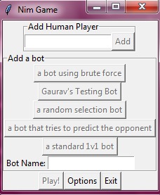
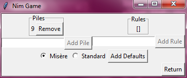
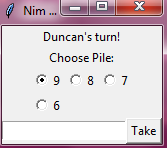

# NimGame

## Table of Contents

* [Intro](#Intro)
* [How to Use](#howtouse)
* [About the Bots](#about-the-bots)
	* [NimBots](#nimbots)
		* [Random Bot](#randombot)
		* [Standard 1v1 Bot](#std1v1bot)
		* [Gaurav's Test Bot](#testbotdesc)
		* [Brute Force Bot](#bruteforcedesc)
		* [Short Prediction Bot](#shortpredictdesc)
* [Documentation](#Documentation)
	* [Main](#main)
	* [NimInstance](#NimInstance)
	* [PlayerController](#PlayerController)
	* [NimBots](#nimbotdesc)
	* [NimGUI](#NimGUI)
	* [WinConditions](#WinConditions)
* [Pseudocode](#Pseudocode)
	* [shortPredictionBot](#shortPredictionBot)
	* [bruteForceBot](#bruteForceBot)
	* [gauravTestingBot](#gauravTestingBot)
* [Bot Complexity Analysis](#Bot-Complexity-Analysis)
	* [standard1v1Bot Analysis](#standard1v1bot-analysis)
 	* [gauravTestingBot Analysis](#gauravTestingBot-analysis)
 	* [ShortPredictionBot Analysis](#shortPredictionBot-Analysis)
* [Algorithm Correctness](#Algorithm-Correctness)
	* [Nim Sums](#Nim-Sums)
	* [Special Misère Condition](#specialwincon)
	* [Accounting for Other Win Conditions](#otherwincons)

---

<br>

# Intro
Project for CPSC-482 which contains a playable version of the Nim game with customizable rules and bots of varying difficulty to play against.

---

<br>

# How to Use <a name="howtouse"></a>

Run [`main.py`](./main.py) from the terminal or cmd. This will create a gui.



To add Human Players to the game, one must enter a name first in the `Add Human Player` section. Then press the `Add` button. If done correctly, the name of the new player should show up on the right side of the application.

Similarly to add bots, enter a name in the `Bot Name` entry, and select the button that corresponds to the desired bot. Again, the bot's name will appear on the right, appended with the word 'bot'.

The `Play!` button will remain disabled until at least one player has been added to the player list. If all players are removed from a non-empty player list, the button will disable until at least one player is added again.

Pressing the `Play!` button will result in a new game of Nim beginnning, with the players in the player list, and the currently selected settings.

To change the settings, click on the `settings` button. This will bring up the `settings` menu:



The entry to the left of the `Add Pile` button will only accept digits as an entry. Entering some number into this entry and then pressing the `Add Pile` button will add a pile with the entry's number of objects to the game settings.

The entry on the right will accept any input, but pressing the `Add Rule` button will only have effect if the entry is a non-zero length list of digits. Individual digits can be separated by any character. Once a rule is added, a game of Nim will terminate if the game state is identical to one of that rule, or any other rule in the rule list.

The `Radio Button` below allows one to change the settings from Misere play to Standard play. However, not all of the bots have strategies for Normal play.

The `Add Defaults` button will add the default rules given in the class assignment description if they are not already in the rule list. 

These rules are:

* [2, 2, 2]
* [1, 2, 3]
* [1, 1, 2, 2]

The `Return` button will bring you back to the Main Menu.

Once a game of Nim has been started with the `Play!` button, the GUI will take turns waiting for the [`PlayerController`](#PlayerController)s to supply it with their next move.

Bots will generate moves automatically and inform the user of their move with a message screen. Simply press the `Ok` button to advance to the next turn. 

Human players will be prompted with a move selection screen:



The `RadioButton` is used to select which pile to take from. Select the pile you wish to take from and then enter the amount into the entry below. This entry will only accept digits between 1 (inclusive) and the size of the currently selected pile. Once you have entered the amount and pressed the `Take` button, the GUI will inform the [`NimInstance`](#NimInstance) of your move and proceed.

Winning a game will display a victory screen with a single button. Pressing the button will return you to the Main Menu, where you can decide to play again, change the players or rules, or exit the application.

---

<br>

# About the Bots

In this project are included several bots with varying strategies. These are included for testing and demonstration purposes. The implementation of all of these can be found in [`NimBots.py`](./NimBots.py)

The bot that we have created specifically for this project is the [`shortPredictionBot`](https://github.com/iamgauravsatija/NimGame/blob/main/NimBots.py#L228), which is described as "a bot that tries to predict the opponent" in the GUI. This is the best performing bot in terms of the specifications given in class that has a reasonable execution time.

<br>

# [NimBots](./NimBots.py) <a name="nimbotdesc"></a>
## [Random Bot](linenum) <a name="randombot"></a>

As the name suggests, this bot randomly generates a legal move. The accuracy of play is low, but the calcluation of its next move is fast and it is good for testing purposes.

## [Standard 1v1 Bot](https://github.com/iamgauravsatija/NimGame/blob/main/NimBots.py#L22) <a name="std1v1bot"></a>

This bot will always play optimally in a game where the only win condition is all heaps are empty. The performance cost is low, and it plays optimally in both normal and misère play. 

Its only weaknesses are that it cannot account for other win conditions and it cannot account for a game with more than one other player.

## [Gaurav's Test Bot](https://github.com/iamgauravsatija/NimGame/blob/main/NimBots.py#L87) <a name="testbotdesc"></a>

This bot was made for testing purposes and selects a pile which it believes to be most optimal. It then checks every move it can make on that pile and searches for the best move.

## [Brute Force Bot](https://github.com/iamgauravsatija/NimGame/blob/main/NimBots.py#L183) <a name="bruteforcedesc"></a>

This bot recursively checks all possible moves and game states through brute force to determine whether or not it is in a winning position. 

This is determined by whether or not there exists a move in which no matter what move the enemy makes, the bot will remain in a winning position. This is then defined recursively, where the base case for a winning position is the position in which the bot cannot make another turn (this definition only works for misère play).

Recursion terminates immediately upon finding a single winning move, in which case the bot plays it. If the bot is not in a winning postion (i.e. cannot find a winning move) it will play the first move it finds that does not immediately lose the game. If that cannot be found, then it will take one object from the first (only) pile.


<text style="color:red"><Strong>Warning:</strong></text> Due to the brute-force nature of the algorithm, the calculation of moves is extremely costly and can cause the program to hang. Total object amounts of around 25 have shown to be slightly unresponsive, but manageable. Increasing the total object amount from there begins to increase the computation costs in drastic amounts. Use this bot with caution.

## [Short Prediction Bot](https://github.com/iamgauravsatija/NimGame/blob/main/NimBots.py#L228) <a name="shortpredictdesc"></a>

This bot is the best balance of performance cost and accuracy. The bot is designed to play 1v1's in misère play. 

This bot works by playing optimally as if it were playing a standard Nim game, but looks ahead to avoid extra win conditions and enemy moves which may gain an advantage.

The algorithm and correctness is discussed further in [`Algorithm Correctness`](#algorithm-correctness)

---

<br>

# Documentation

## [main](./main.py)

Simple entry point for program. Runs a GUI.

## [NimInstance](./NimInstance.py)

A class used to store and manipulate information on an instance of a game of Nim, such as the piles and the objects that are currently in said piles.

Stores win conditions as a list of lists. This allows any various win states to be added and checked against when playing.

## [PlayerController](./PlayerController.py)

An 'abstract' class which is used as a controller for players in a game of Nim. Is used as a super class for bots. Takes a callback method which can be used to determine what happens when it is this controller's turn to play.

## [NimBots](./NimBots.py)

Contains various classes that inherit the [`PlayerController`](./PlayerController.py) class. These classes are designed to programmatically generate decisions on what move to make in a game of Nim, based on the current state of the piles. Any new class added to this file is automatically constructed as a bot option in the GUI.

## [NimGUI](./NimGUI.py)

Contains the logic and controllers for the GUI. Also controls the order and flow of a Nim game, stores settings for a Nim game to be created, and contains a 'bot factory', for automatically creating instances of bot classes found in `NimBots.py`.

## [WinConditions](./WinConditions.py)

Contains 'constants' for the default win conditions that will be used in class for convenience.

---

<br>

# Pseudocode

## shortPredictionBot

```
using a list of object amounts

if (number of piles with objects > 1) == 1
{
    if (number of piles with objects == 1) is odd
    {
        try removing the large pile
        
        if it results in a loss undo and continue

        otherwise submit move
    }
    otherwise,
    {           
        try taking all but one from large pile

        if it results in a loss undo and continue

        otherwise submit move
    }
}

for all possible moves that create a pile with a nim sum of zero
{
    -try the move
    -then predict all of the oppoenents possible 
     moves

    if a move exists where there is no winning
    move afterwards:
        undo the move and continue

    otherwise submit move 
}

Try all possible moves (that don't lose):

    If one exists that puts the opponent in a 
    losing position:
        Submit the move
    
    Otherwise:
        Submit the move that leaves the largest
        pile

Only losing moves are left: play the first move

```

## bruteForceBot

```
using a list of object amounts

Method for finding a winning move:
{
    if list is in a win state
    {
        if your turn: return 'winning'
        else: return 'losing'
    }


    For all possible moves:
    {
        recurse with not your turn

        if the recursion returns 'winning': 
            return 'winning'
        
        Otherwise: continue
    }

    return 'losing'
}

Method for choosing a move:
{
    Try to find a winning move:
    {
        if found: play it

        Otherwise: continue 
    }

    For all possible moves:
    {
        try the move:
        {
            if it immediately loses: continue

            Otherwise: play it
        }
    }
}

```
<br>

## gauravTestingBot
	1. Bot reads the input to analyze the current situation
	2. Then chooses a pile 
	(not sure what should be the criteria to choose one {first pile, second pile…} {pile with most obj} etc.)
	
	For a standard game with only the first win condition:
		X = 0
		for each pile in list:
			X = X xor pile
			
		for each pile in list:
			if pile < X xor pile:
				Choose this pile
				break
		
		If it didn't find a pile, then it's losing.
	
	
	3. After the pile n is chosen, take one object from it;   object count = 1 
	4. Call check_function()        {returns TRUE or FALSE}
		○ 4th condition
		○ 3 piles each with 2 objects, and all other piles are empty.
		○ 1 pile with 1 object, 1 pile with 2 objects, 1 pile with 3 objects, all other piles are empty.
		○ all piles are empty. We need this check because there may be condition n=3 
		
	5. If check() == TRUE:
		○ Increase the object count by 1 
		○ Call check function (step 4)
		○ Recursion this check function == false at object count = i
		○ Return count = i-1
	6. If check() == False:
		○ Choose next pile based on criteria
		○ Repeat from step 3
		
	7. Check if new situation == old situation:
		○ True: You lost
		○ False: send to next bot.
   
   Link to image of [pseudocode](https://user-images.githubusercontent.com/32801600/112295613-4dc61980-8c51-11eb-8720-5645388e8539.png)

---
<br>

# Bot Complexity Analysis

## <b>Standard1v1Bot Analysis:</b>
n represents the number of piles <br>
m represents number of objects the pile with most objects has. <br>


<Strong>Methods:</strong>
<br>
1. [getStandardChoice](https://github.com/iamgauravsatija/NimGame/blob/main/NimBots.py#L37): O(n) + O(n) => O(n)
2. [getMisereChoice](https://github.com/iamgauravsatija/NimGame/blob/main/NimBots.py#L57): O(n) + O(getStandardChoice) => O(n) + O(n) => O(n)
3. [playTurn](https://github.com/iamgauravsatija/NimGame/blob/main/NimBots.py#L28): O(1)

Total Complexity is the sum of above three complexity.

<b>Total Complexity: </b> O(n) + O(n) + O(1) = <b>O(n) </b>
<br>

## <b>gauravTestingBot Analysis:</b>
n represents the number of piles <br>
m represents number of objects the pile with most objects has. <br>

<Strong>Methods:</strong>
1. [checkMove](https://github.com/iamgauravsatija/NimGame/blob/main/NimBots.py#L93): O(n) 
2. [getNextMove](https://github.com/iamgauravsatija/NimGame/blob/main/NimBots.py#L150): O(m)
3. [choosePile](https://github.com/iamgauravsatija/NimGame/blob/main/NimBots.py#L93): O(n) + O(n) => O(n)

Total Complexity is the sum of above three complexity.

<b>Total Complexity: </b> O(n) + O(m) + O(n) = <b>O(m + n) </b>
<br>


## <b>shortPredictionBot Analysis:</b>
n represents the number of piles <br>
m represents number of objects the pile with most objects has. <br>

<Strong>Methods:</strong>
1. [getNimSum](https://github.com/iamgauravsatija/NimGame/blob/main/NimBots.py#L238):  O(n)
2. [getZeroSumMoves](https://github.com/iamgauravsatija/NimGame/blob/main/NimBots.py#L247): O(n) + O(n) => O(n)
3. [isTrap](https://github.com/iamgauravsatija/NimGame/blob/main/NimBots.py#L263): O(n) + O(n) => O(n)
4. [makeChoice](https://github.com/iamgauravsatija/NimGame/blob/main/NimBots.py#L299): O(n) + O(n) + O(n*m) + O(n) => O(n)

Total Complexity is the sum of mostly [makeChoice]() and [getZeroSumMoves]() complexity

<b>Total Complexity: </b> O(n) + O(n) = <b>O(n*m) </b>


---

<br>

# Algorithm Correctness

## Nim sums

A nim-sum is a mathematical concept used to determine whether a position is winning or losing in the game of Nim. In the Nim game it is known that if both players make no mistakes and the nim-sum at the beginning of the game is <b>not</b> zero, then the player starting is guaranteed to win. If the players make no mistakes and the nim sum at the beginning of the game <b>is</b> zero then the player who does not go first is guaranteed to win.

The nim-sum is calculated by performing carryless binary addition on the size of all non-zero heaps. This is equivalent to bitwise-xor on the size of all heaps. It is known by the Sprague-Grundy theorem that a winning strategy in a misère game of Nim is to always end a move with a nim-sum of 0 until a certain condition is met. Our [`shortPredictionBot`](https://github.com/iamgauravsatija/NimGame/blob/main/NimBots.py#L228) uses this strategy, along with short-sighted forward prediction to inform itself of the next favorable move. 

## Special Misère Condition <a name="specialwincon"></a>

The known condition where one must change strategy in misère play to win, is where exactly one pile with a size greater than one exists. If this condition is met, the winning player must abandon the nim-sum strategy in order to create an odd number of piles of size one. This is because 1 is an odd number, and the player that begins a turn with only one pile of size one will lose. 

Our [`shortPredictionBot`](https://github.com/iamgauravsatija/NimGame/blob/main/NimBots.py#L228) first checks for this special condition before attempting to create a nim-sum of zero. This guarantees that the bot follows optimal play when the only win condition is all empty piles.

## Accounting for Additional Win Conditions <a name="otherwincons"></a>

The [`shortPredictionBot`](https://github.com/iamgauravsatija/NimGame/blob/main/NimBots.py#L228) accounts for other win conditions, and can account for any general win condition, with the [`isTrap`](https://github.com/iamgauravsatija/NimGame/blob/main/NimBots.py#L263) method. A 'trap' in this case is defined as a move that results in a position that:

1. Does not lose for the player that performs it
2. Does not create a state in which the next move can create a state which does not immediately lose and in which there is exactly one pile of size greater than one
3. Does create a state in which the next move can create a state in which there is exactly one pile of size greater than one, but does immediately lose upon making it
4. Creates a state in which it is not possible to achieve a nim-sum of zero without immediately losing. 

By detecting 'traps' in advance, the bot can react to additional win conditions and adjust its strategy when normal play is no longer optimal. When the bot detects a potential trap, it will instead try to set a trap of its own, in order to gain an advantage over the opponent on the next turn. Although we were unable to prove that this bot will play optimally in every given position (unlike the [`bruteForceBot`](https://github.com/iamgauravsatija/NimGame/blob/main/NimBots.py#L183) which has a complexity too extereme to be viable) due to the short-sightedness of its predictions, it <b>will</b> play optimally in a large majority of positions, and can even regularly beat [`bruteForceBot`](https://github.com/iamgauravsatija/NimGame/blob/main/NimBots.py#L183) (which does play optimally in every position) when starting in a winning position.
